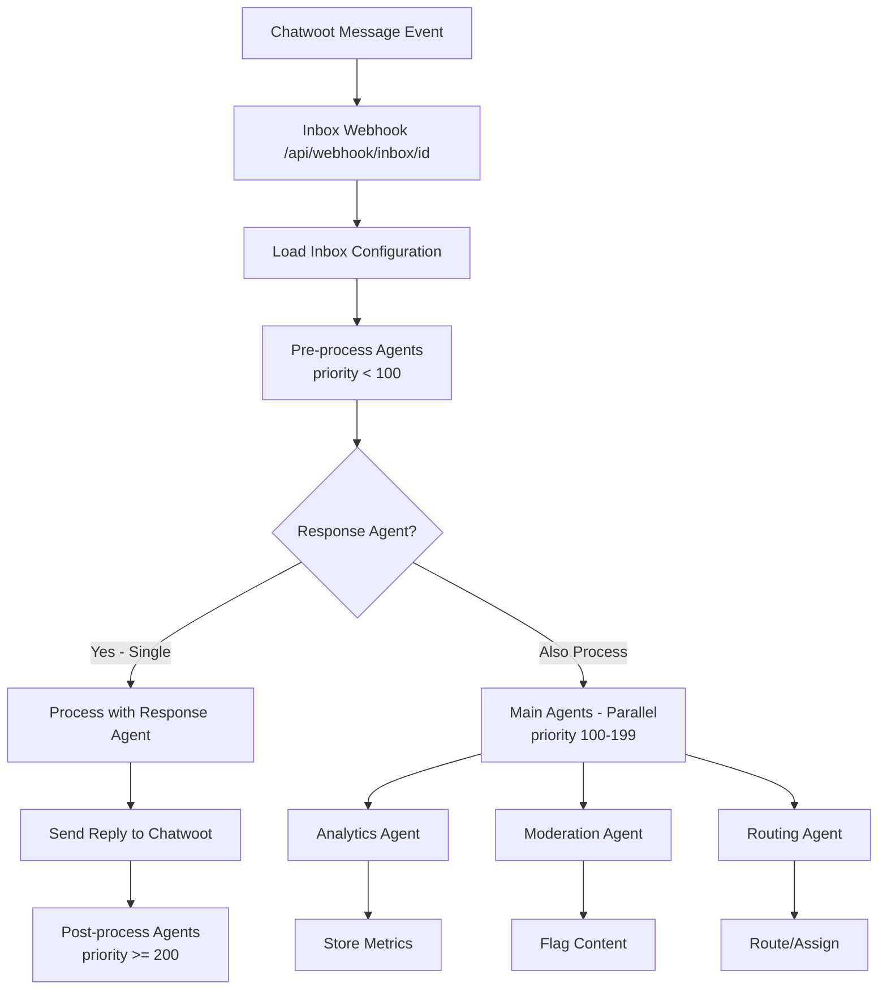
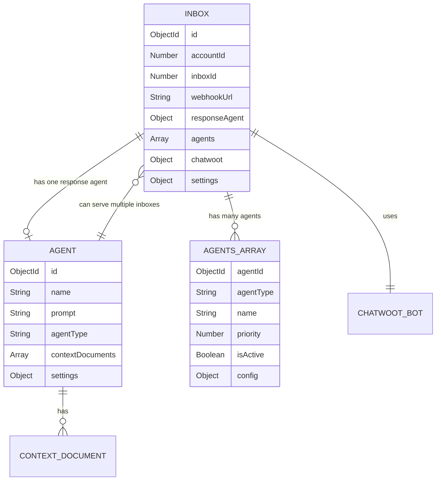

# Inbox-Centric Architecture Implementation Plan

## Executive Summary
Build a new inbox-centric architecture where Chatwoot inboxes are the primary entities, with agents operating based on inbox configurations. This is a greenfield implementation with no migration or backwards compatibility requirements.

### Key Design Decisions
- **One Response Agent per Inbox**: Maintains the constraint that only one response agent can be assigned to an inbox
- **Simple Agents Array**: Single array for all non-response agents, processed by priority
- **Agent Reusability**: A single agent can be assigned to multiple inboxes (both as response or in agents array)
- **Priority-Based Processing**: All agents processed based on priority field
- **No Migration Needed**: Fresh implementation without data migration concerns
- **No Backwards Compatibility**: Clean break from current architecture

## Architecture Design

### Current Limitations (Agent-Centric)
- **Primary Entity**: Agent
- **Webhook Pattern**: `/api/webhook/agent/[agentId]`
- **Flow**: Agent → Creates Bot → Configures Inboxes → Processes Messages
- **Data Model**: Agent contains inboxes array and webhook URL

### New Architecture (Inbox-Centric)
- **Primary Entity**: Inbox (sourced from Chatwoot)
- **Webhook Pattern**: `/api/webhook/inbox/[inboxId]`
- **Flow**: User accesses Agent AI → System syncs with Chatwoot → Inboxes automatically created → User assigns agents
- **Inbox Source**: All inboxes are created in Chatwoot first, then automatically synced to Agent AI
- **User Access Control**: Users can only see and manage inboxes they have access to in Chatwoot
- **Constraints**: 
  - One response agent per inbox (maintained)
  - Multiple additional agents allowed
  - Agents can be assigned to multiple inboxes
  - Users cannot manually create inboxes in Agent AI
- **Data Model**: Inbox owns webhook config; agents can be assigned to multiple inboxes

### Core Benefits
1. **Decoupling**: Inbox webhook independent of specific agents
2. **Simplified Processing**: Single agents array for all non-response agents
3. **Agent reusability**: One agent can serve multiple inboxes
4. **Simplified bot management**: One bot per inbox
5. **Flexible pipeline**: Priority-based agent processing

## Implementation Plan

### Phase 1: Database Schema (Week 1)

#### 1.1 Create Inbox Model
```javascript
// server/models/Inbox.js
{
  // Identity
  accountId: Number,         // Chatwoot account ID
  inboxId: Number,          // Chatwoot inbox ID
  name: String,
  channelType: String,      // email, web_widget, api, whatsapp, etc.
  
  // Webhook Configuration
  webhookUrl: String,       // Generated: /api/webhook/inbox/[id]
  webhookSecret: String,    // For webhook validation
  
  // Chatwoot Integration
  chatwoot: {
    apiKey: String,         // Inbox-specific API key
    botId: Number,          // Associated bot ID
    botName: String,
    isConfigured: Boolean,
    lastSync: Date
  },
  
  // Response Agent (Constraint: Only ONE allowed)
  responseAgent: {
    agentId: ObjectId,      // Reference to Agent model
    assignedAt: Date,
    config: Object         // Inbox-specific config overrides
  },
  
  // Additional Agents (Multiple allowed)
  agents: [{
    agentId: ObjectId,      // Reference to Agent model
    agentType: String,      // pre-process, analytics, moderation, routing, post-process
    name: String,           // Display name
    priority: Number,       // Processing order (lower = earlier)
    isActive: Boolean,
    config: Object         // Agent-specific configuration for this inbox
  }],
  
  // Settings
  settings: {
    processDelay: Number,
    enableLogging: Boolean,
    enableAnalytics: Boolean
  },
  
  // Metadata
  createdBy: Mixed,
  isActive: Boolean,
  timestamps: true
}

// Indexes
inboxSchema.index({ accountId: 1, inboxId: 1 }, { unique: true })
inboxSchema.index({ 'responseAgent.agentId': 1 })
inboxSchema.index({ 'agents.agentId': 1 })
```

#### 1.2 Update Agent Model
```javascript
// server/models/Agent.js
{
  // Core fields (unchanged)
  name: String,
  description: String,
  prompt: String,
  agentType: String,        // response, pre-process, analytics, moderation, routing, post-process
  contextDocuments: Array,
  settings: Object,
  createdBy: Mixed,
  isActive: Boolean,
  
  // Remove: webhookUrl, inboxes array, chatwootBot
  // Agents no longer own inboxes - inboxes reference agents
  
  // Virtual property to get assigned inboxes (computed from Inbox model)
}

// Static methods
agentSchema.statics.getAssignedInboxes = async function(agentId) {
  const Inbox = mongoose.model('Inbox')
  return await Inbox.find({
    $or: [
      { 'responseAgent.agentId': agentId },
      { 'agents.agentId': agentId }
    ]
  })
}

### Phase 2: API Layer Updates (Week 2)

#### 2.1 New Inbox Management APIs
```typescript
// server/api/inboxes/
- index.get.ts        // List user's accessible inboxes (auto-sync from Chatwoot)
- [id].get.ts        // Get inbox details
- [id].put.ts        // Update inbox config (agent assignments only)
- sync.post.ts       // Manual sync with Chatwoot to discover new inboxes
- test-webhook.post.ts // Test webhook configuration

// Note: No create/delete endpoints - inboxes managed in Chatwoot only
```

#### 2.2 New Webhook Handler
```typescript
// server/api/webhook/inbox/[id].post.ts
export default defineEventHandler(async (event) => {
  const inboxId = getRouterParam(event, 'id')
  const payload = await readBody(event)
  
  // Load inbox with agents
  const inbox = await Inbox.findById(inboxId).populate(['responseAgent.agentId', 'agents.agentId'])
  
  if (payload.event === 'message_created') {
    // Sort agents by priority
    const sortedAgents = inbox.agents
      .filter(a => a.isActive)
      .sort((a, b) => a.priority - b.priority)
    
    // 1. Pre-processing agents (priority < 100)
    const preProcessAgents = sortedAgents.filter(a => a.priority < 100)
    for (const agent of preProcessAgents) {
      await processWithAgent(agent.agentId, payload, agent.config)
    }
    
    // 2. Response agent (if configured)
    if (inbox.responseAgent?.agentId) {
      const response = await processWithAgent(inbox.responseAgent.agentId, payload, inbox.responseAgent.config)
      await chatwootService.sendMessage(response)
    }
    
    // 3. Main processing agents (priority 100-199, parallel)
    const mainAgents = sortedAgents
      .filter(a => a.priority >= 100 && a.priority < 200)
      .map(agent => processWithAgent(agent.agentId, payload, agent.config))
    
    await Promise.allSettled(mainAgents)
    
    // 4. Post-processing agents (priority >= 200)
    const postProcessAgents = sortedAgents.filter(a => a.priority >= 200)
    for (const agent of postProcessAgents) {
      await processWithAgent(agent.agentId, payload, agent.config)
    }
  }
})
```

#### 2.3 Agent Assignment APIs
```typescript
// server/api/inboxes/[id]/agents/
- response.put.ts    // Assign/update response agent (validates single agent)
- response.delete.ts // Remove response agent
- index.get.ts      // List all agents for inbox
- index.post.ts     // Add agent to agents array
- [agentId].put.ts  // Update specific agent config
- [agentId].delete.ts // Remove specific agent
```

### Phase 3: Service Layer Updates (Week 2-3)

#### 3.1 Create Inbox Service
```typescript
// server/services/inboxService.ts
class InboxService {
  // Inbox operations (read-only from user perspective)
  async getInboxesForUser(userId) // Get user's accessible inboxes from Chatwoot + sync
  async updateInboxConfig(id, data) // Update agent assignments only
  
  // Chatwoot integration
  async syncUserInboxes(userId) // Discover and create user's inboxes from Chatwoot
  async configureWebhook(inboxId)
  async createOrUpdateBot(inboxId)
  
  // Response Agent management (enforces single agent constraint)
  async assignResponseAgent(inboxId, agentId, config) {
    const agent = await Agent.findById(agentId)
    if (agent.agentType !== 'response') {
      throw new Error('Only response agents can be assigned as primary')
    }
    
    const inbox = await Inbox.findById(inboxId)
    inbox.responseAgent = { agentId, assignedAt: new Date(), config }
    return await inbox.save()
  }
  
  // Agents array management
  async addAgent(inboxId, agentId, config) {
    const agent = await Agent.findById(agentId)
    if (agent.agentType === 'response') {
      throw new Error('Response agents must be assigned as responseAgent, not in agents array')
    }
    
    const inbox = await Inbox.findById(inboxId)
    inbox.agents.push({
      agentId,
      agentType: agent.agentType,
      name: agent.name,
      priority: config.priority || 100,
      isActive: true,
      config: config.overrides || {}
    })
    
    return await inbox.save()
  }
  
  // Event processing
  async processWebhookEvent(inboxId, event)
  async routeToAgents(inboxId, message)
}
```

#### 3.2 Update Agent Service
```typescript
// Modify existing agent service
- Remove inbox management logic
- Focus on agent-specific operations
- Add methods for inbox assignment
```

#### 3.3 Create Agent Processing Engine
```typescript
// server/services/agentProcessingEngine.ts
class AgentProcessingEngine {
  async processAgent(agent, message, config)
  async executePreProcessAgents(inbox, message)
  async executeMainAgents(inbox, message)  // Parallel
  async executePostProcessAgents(inbox, message)
}
```

### Phase 4: Frontend Updates (Week 3-4)

#### 4.1 New Inbox Management UI
```vue
// pages/inboxes/
- index.vue          // List user's accessible inboxes (auto-synced)
- [id].vue          // Inbox details & agent configuration

// components/Inbox/
- InboxCard.vue      // Display inbox with sync status
- WebhookConfig.vue  // View webhook configuration (read-only)
- AgentAssignment.vue // Assign agents to inbox
- AgentPipeline.vue  // Manage processing pipeline
- SyncStatus.vue     // Show Chatwoot sync status

// Note: No InboxForm.vue - inboxes are read-only from Chatwoot
```

#### 4.2 Update Agent UI  
```vue
// components/Inbox/AgentAssignment.vue
<template>
  <div>
    <!-- Response Agent Section (Single) -->
    <div class="response-agent">
      <h3>Response Agent</h3>
      <select v-model="inbox.responseAgent.agentId">
        <option value="">No response agent</option>
        <option v-for="agent in responseAgents" :value="agent._id">
          {{ agent.name }}
        </option>
      </select>
    </div>
    
    <!-- Additional Agents Section (Multiple) -->
    <div class="additional-agents">
      <h3>Processing Pipeline</h3>
      
      <!-- List of configured agents -->
      <draggable v-model="inbox.agents" handle=".handle">
        <div v-for="agent in inbox.agents" :key="agent._id" class="agent-item">
          <span class="handle">⋮⋮</span>
          <span class="type-badge">{{ agent.agentType }}</span>
          <span class="name">{{ agent.name }}</span>
          <span class="priority">Priority: {{ agent.priority }}</span>
          <toggle v-model="agent.isActive" />
          <button @click="removeAgent(agent._id)">Remove</button>
        </div>
      </draggable>
      
      <!-- Add new agent -->
      <div class="add-agent">
        <select v-model="selectedAgent">
          <option value="">Select an agent to add</option>
          <option v-for="agent in availableAgents" :value="agent._id">
            {{ agent.name }} ({{ agent.agentType }})
          </option>
        </select>
        <input v-model="priority" type="number" placeholder="Priority (default: 100)">
        <button @click="addAgent">Add to Pipeline</button>
      </div>
    </div>
  </div>
</template>

// pages/agents/[id].vue
- Show list of inboxes where this agent is assigned
- Distinguish between "Response Agent for" and "Processing Pipeline" assignments
```

#### 4.3 New Store
```javascript
// stores/inboxes.js
export const useInboxesStore = defineStore('inboxes', () => {
  const inboxes = ref([])
  
  const fetchInboxes = async () => {} // Auto-syncs with Chatwoot on load
  const updateInbox = async (id, data) => {} // Agent assignments only
  const syncWithChatwoot = async () => {} // Manual sync to discover new inboxes
  const assignAgent = async (inboxId, agentId) => {}
  
  // Note: No createInbox/deleteInbox - managed in Chatwoot only
})
```

### Phase 5: Testing (Week 4)

#### 5.1 Testing Strategy
- Unit tests for inbox service with agent constraints
- Integration tests for webhook processing
- Test single response agent enforcement
- Test multiple additional agents processing
- E2E tests for complete inbox management flow
- Load testing for multi-agent parallel processing

#### 5.2 Test Cases
```javascript
// Test response agent constraint
describe('Inbox Response Agent', () => {
  it('should allow only one response agent per inbox')
  it('should reject non-response agents as primary')
  it('should allow response agent to serve multiple inboxes')
  it('should not allow response agents in agents array')
})

// Test agents array
describe('Agents Array', () => {
  it('should process agents by priority order')
  it('should handle agent failures gracefully')
  it('should execute pre-process agents sequentially (priority < 100)')
  it('should process main agents in parallel (priority 100-199)')
  it('should execute post-process agents sequentially (priority >= 200)')
})

// Test processing order
describe('Processing Pipeline', () => {
  it('should process agents with lower priority first')
  it('should run response agent after pre-process agents')
  it('should run response agent before main processing agents')
  it('should respect priority ordering throughout pipeline')
})
```

### Phase 6: Deployment (Week 5)

#### 6.1 Deployment Steps
1. Deploy new database models
2. Deploy backend services (inbox & updated agent services)
3. Deploy new API endpoints
4. Deploy frontend updates
5. Configure first inbox with Chatwoot
6. Assign agents to inboxes
7. Update documentation

#### 6.2 Monitoring
- Track webhook processing times
- Monitor agent execution order
- Alert on failed webhook deliveries
- Dashboard for inbox health
- Track response agent vs additional agent performance

## Technical Considerations

### Performance Optimizations
- Cache inbox configurations
- Queue system for multi-agent processing
- Batch process analytics agents
- Implement circuit breaker for failing agents

### Security Considerations
- Webhook signature validation
- Rate limiting per inbox
- Audit logging for all changes
- Encrypted storage for API keys

## Risk Analysis

### High Risk Items
1. **Performance with multiple agents**: Implement parallel processing and queuing
2. **Agent coordination conflicts**: Use priority system and clear execution order
3. **Webhook reliability**: Implement retry logic and monitoring

### Medium Risk Items
1. **UI complexity for agent management**: Clear separation of response vs additional agents
2. **Config override complexity**: Well-defined merge strategy for inbox-specific configs
3. **Chatwoot API changes**: Abstract all API calls in service layer

## Success Metrics

### Technical Metrics
- Webhook processing latency < 500ms
- 99.9% webhook delivery success rate
- Zero data loss during migration
- Support for 10+ agents per inbox

### Business Metrics
- Reduced setup time for new workflows
- Increased flexibility in agent configurations
- Better resource utilization
- Easier maintenance and debugging

## Timeline Summary

| Phase | Duration | Dependencies | Deliverables |
|-------|----------|--------------|--------------|
| Phase 1 | Week 1 | - | Database schemas for Inbox and updated Agent models |
| Phase 2 | Week 2 | Phase 1 | API endpoints for inbox management, new webhook handler |
| Phase 3 | Weeks 2-3 | Phase 2 | InboxService, updated AgentService, AgentProcessingEngine |
| Phase 4 | Weeks 3-4 | Phase 3 | Inbox management UI, agent assignment UI, stores |
| Phase 5 | Week 4 | Phases 1-4 | Comprehensive testing suite |
| Phase 6 | Week 5 | Phase 5 | Production deployment and monitoring |

## Next Steps

1. **Review & Approval**: Team review of this plan
2. **Create detailed tickets**: Break down into JIRA/GitHub issues
3. **Set up development branch**: `feature/inbox-centric-architecture`
4. **Begin Phase 1**: Start with database schema design
5. **Daily standups**: Track progress and blockers

## Appendix

### A. Example Webhook Flow (New Architecture)



### B. Database Relationship Diagram



### C. Key API Endpoints

| Endpoint | Method | Purpose |
|----------|--------|---------|
| `/api/inboxes` | GET | List user's accessible inboxes (auto-syncs from Chatwoot) |
| `/api/inboxes/sync` | POST | Manual sync with Chatwoot to discover new inboxes |
| `/api/inboxes/[id]` | GET/PUT | Get inbox details / Update agent assignments only |
| `/api/inboxes/[id]/agents/response` | PUT/DELETE | Manage response agent (single) |
| `/api/inboxes/[id]/agents` | GET/POST | List/Add agents to agents array |
| `/api/inboxes/[id]/agents/[agentId]` | PUT/DELETE | Update/Remove specific agent from agents array |
| `/api/webhook/inbox/[id]` | POST | Receive Chatwoot events |
| `/api/agents` | GET/POST | List/Create agents (no inbox assignment) |
| `/api/agents/[id]/inboxes` | GET | List inboxes where agent is assigned |

### D. Processing Priority System

```javascript
// Suggested Priority Ranges
const PRIORITY_RANGES = {
  preProcessAgents: '1-99',        // Sequential execution before response
  responseAgent: 'N/A',            // Always runs after pre-process
  mainProcessAgents: '100-199',    // Parallel execution (analytics, moderation, routing)
  postProcessAgents: '200+',       // Sequential execution after main processing
}

// Example agents array with priorities
inbox.agents = [
  { agentId: '...', agentType: 'pre-process', priority: 10, name: 'Spam Filter' },
  { agentId: '...', agentType: 'pre-process', priority: 20, name: 'Language Detection' },
  { agentId: '...', agentType: 'analytics', priority: 100, name: 'Sentiment Analysis' },
  { agentId: '...', agentType: 'moderation', priority: 110, name: 'Content Moderator' },
  { agentId: '...', agentType: 'routing', priority: 120, name: 'Team Router' },
  { agentId: '...', agentType: 'post-process', priority: 200, name: 'Log Archive' }
]
```

### E. Agent Type Constraints

```javascript
// Agent Type Rules
const AGENT_TYPES = {
  response: {
    maxPerInbox: 1,
    assignmentField: 'responseAgent',  // Separate field, not in agents array
    canProcess: ['message_created', 'message_updated']
  },
  'pre-process': {
    maxPerInbox: undefined,
    assignmentField: 'agents',
    suggestedPriority: '1-99',
    executionMode: 'sequential'
  },
  analytics: {
    maxPerInbox: undefined,
    assignmentField: 'agents',
    suggestedPriority: '100-199',
    executionMode: 'parallel'
  },
  moderation: {
    maxPerInbox: undefined,
    assignmentField: 'agents',
    suggestedPriority: '100-199',
    executionMode: 'parallel'
  },
  routing: {
    maxPerInbox: undefined,
    assignmentField: 'agents',
    suggestedPriority: '100-199',
    executionMode: 'parallel'
  },
  'post-process': {
    maxPerInbox: undefined,
    assignmentField: 'agents',
    suggestedPriority: '200+',
    executionMode: 'sequential'
  }
}
```
